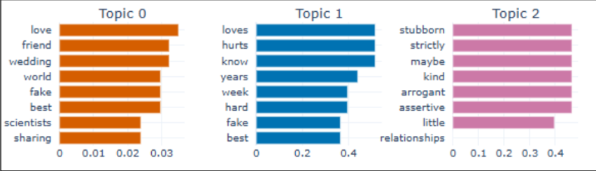
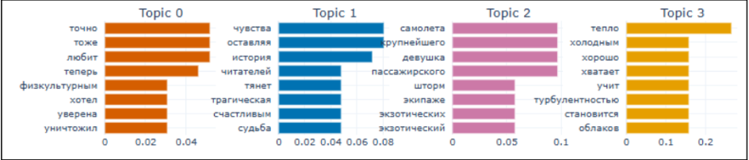
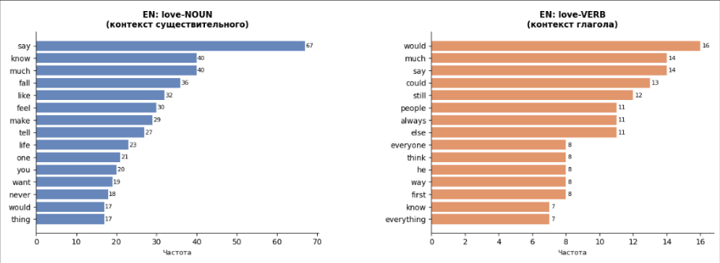
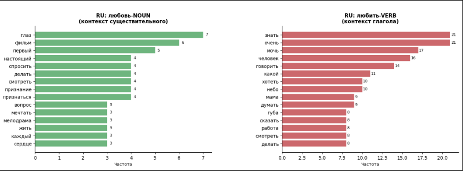

# new-adult-young-adult-book-analysis
Анализ русских и английских new adult и young adult произведений с темой любви.

### Корпус
Корпус текстов для исследования формировался по строгим жанровым и тематическим критериям.

Критерии отбора:

* Жанр: New Adult и Young Adult (тексты для аудитории 14–25 лет).

* Тематика: фокус на теме любви, взросления и самоидентификации.

* Стилистика: доступный язык, высокая диалогичность, динамичный нарратив.

* Языковой баланс: равное соотношение англоязычных и русскоязычных текстов (50/50) для кросс-культурного анализа.
Полный список произведений, использованных для формирования корпуса, хранится локально в соответствии с лицензионными ограничениями на распространение контента. В репозитории представлены только метаданные (названия, авторы, год издания) и синтетические данные для воспроизводимости пайплайна.

### Описание кода

В файле `N_Y_adult.ipynb` содержится пайплайн для работы с разнородными источниками данных: электронными книгами (EPUB) и аудиокнигами (M4A).
Далее код для предобработки текста и аннотации: унификация кодировок, нормализация пробелов, удаление спецсимволов, приведение к нижнему регистру для различных этапов исследования. 

### Этапы работы
**EDA (Разведочный анализ данных)**

*Графики выведены в файле.
- Статистические данные количеству символов слов и предложений
- Анализ длины слов
- Индекс читаемости (Flesch Reading Ease, Flesch-Kincaid Grade Level, Gunning Fog и SMOG Index, Automated Readability и Dale-Chall)
- Частотный анализ
- Частеречный анализ
- TTR (Type-Token Ratio)
  
  

**Тематическое моделирование**
  - Визуализация тем
  - Сопоставление в подкорпусах

Различие в репрезентации концепта: в русскоязычных текстах лексема *любить* встречается преимущественно в глагольной форме. Это отражается в POS-статистике и указывает на динамическую, процессуальную природу описания отношений в данной выборке.

Лексическое распределение: частотный анализ показал, что в английском подкорпусе лексема *love* чаще функционирует как существительное, что влияет на семантическую нагрузку соответствующих тем.

**Контекстный анализ лексем *love* и *любовь/любить* в двуязычном корпусе романтической прозы**

* В английском подкорпусе лексема *love* в роли существительного окружена преимущественно глаголами коммуникации и когниции (*say, know, feel, tell*), что свидетельствует о её употреблении в контекстах рефлексии и речевого высказывания о чувстве. Глагол love формирует модально-темпоральное окружение (*would, could, still, always*), указывающее на условность и длительность переживания.
* В русском подкорпусе существительное любовь сопровождается оценочными прилагательными (*настоящий, первый*) и романтическими номинациями (*признание, сердце*), тогда как глагол любить образует динамическое окружение с наречием интенсивности очень и глаголами действия и желания (*мочь, говорить, хотеть, делать*).

